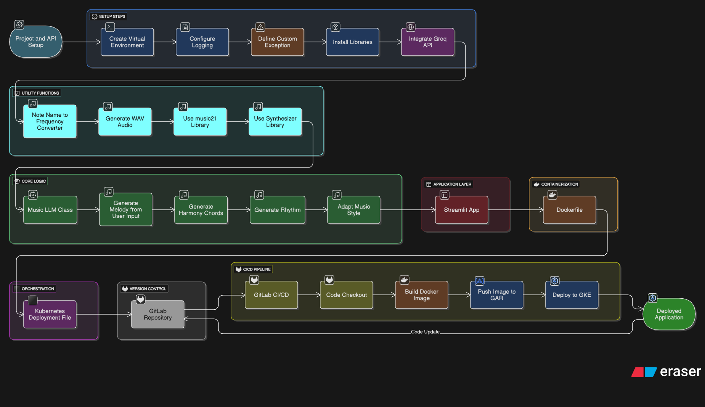

# 🎵 AI Music Composer

[](https://www.python.org/downloads/release/python-314/)
[](https://streamlit.io/)
[](https://python.langchain.com/)
[](https://www.docker.com/)
[](https://kubernetes.io/)

> **Generate AI Music by describing the style and content.**

An advanced, AI-powered application that leverages the capabilities of Large Language Models (LLMs) to compose original music. By interpreting user-provided text descriptions and desired musical styles, the application orchestrates melody, harmony, and rhythm to synthesize a complete musical composition and outputs a playable audio file (WAV) directly in the browser.

---

## 📑 Table of Contents
- [Architecture](#-architecture)
- [Features](#-features)
- [Tech Stack](#-tech-stack)
- [Folder Structure](#-folder-structure)
- [Getting Started](#-getting-started)
  - [Prerequisites](#prerequisites)
  - [Local Installation](#local-installation)
- [Deployment & Infrastructure](#-deployment--infrastructure)
- [Usage](#-usage)
- [Contributing](#-contributing)

---

## 🏗 Architecture

The following diagram illustrates the workflow and architecture of the AI Music Composer, including its integration with Groq, LangChain, and deployment on Google Kubernetes Engine (GKE).



---

## ✨ Features

- **Text-to-Music Generation**: Simply describe the music you want to hear, and the AI will compose it for you.
- **Style Adaptation**: Choose from a variety of musical styles including `Sad`, `Happy`, `Jazz`, `Romantic`, and `Extreme`.
- **Multi-layered Composition**: Generates distinct layers for melody, harmony, and rhythm, and intelligently combines them.
- **Real-time Synthesis**: Converts generated musical notes and chords into frequencies and synthesizes them into a downloadable/playable WAV file instantly.
- **Composition Summary**: Provides a detailed textual summary of the AI's thought process and the musical structure it created.
- **Cloud-Native Deployment**: Fully containerized using Docker and orchestrated via Kubernetes on Google Cloud Platform (GCP).
- **Automated CI/CD**: Seamless integration with GitLab CI/CD for automated testing and deployment.

---

## 🛠 Tech Stack

### Core Technologies
- **Programming Language**: Python 3.14
- **Web Interface**: [Streamlit](https://streamlit.io/) (v1.57.0)
- **AI / LLMOps**: [LangChain](https://python.langchain.com/) & [Groq API](https://console.groq.com/)
- **Music Processing**: `music21`, `scipy`, `synthesizer`

### Infrastructure & DevOps
- **Containerization**: Docker
- **Orchestration**: Kubernetes (GKE)
- **CI/CD Pipeline**: GitLab CI/CD
- **Cloud Provider**: Google Cloud Platform (GCP - Artifact Registry, GKE)

---

## 📂 Folder Structure

```text
.
├── .gitlab-ci.yml             # GitLab CI/CD Pipeline Configuration
├── app.py                     # Main Streamlit application entry point
├── Dockerfile                 # Docker image build instructions
├── FULL_DOCUMENTATION.md      # Comprehensive deployment & infrastructure guide
├── kubernetes-deployment.yaml # GKE deployment and service configuration
├── requirements.txt           # Python dependencies and versions
├── setup.py                   # Python package configuration
├── Architecture/              # Architecture diagrams and assets
│   └── AI+Music+Composer+Workflow.png
├── Outputs/                   # Directory for storing generated audio outputs
└── app/                       # Core application logic package
    ├── __init__.py
    ├── main.py                # LLM orchestration and composition logic (MusicLLM)
    └── utils.py               # Audio synthesis and frequency calculation utilities
```

---

## 🚀 Getting Started

### Prerequisites

Before you begin, ensure you have the following installed:
- **Python 3.14**
- **pip** (Python package installer)
- **Git**

### Local Installation

1. **Clone the repository:**
   ```bash
   git clone https://github.com/your-username/AI-Music-Composer.git
   cd AI-Music-Composer
   ```

2. **Create and activate a virtual environment (recommended):**
   ```bash
   python -m venv venv
   # On Windows
   venv\Scripts\activate
   # On macOS/Linux
   source venv/bin/activate
   ```

3. **Install dependencies:**
   ```bash
   pip install -r requirements.txt
   ```

4. **Configure Environment Variables:**
   Create a `.env` file in the root directory and add your API keys:
   ```env
   GROQ_API_KEY=your_groq_api_key_here
   ```

5. **Run the Application:**
   ```bash
   streamlit run app.py
   ```
   The application will be accessible in your browser at `http://localhost:8501`.

---

## ☁️ Deployment & Infrastructure

> 🛑 **IMPORTANT NOTICE** 🛑
> 
> A highly detailed, step-by-step guide for setting up the entire production infrastructure is available in the [`FULL_DOCUMENTATION.md`](FULL_DOCUMENTATION.md) file.

The `FULL_DOCUMENTATION.md` covers:
- Enabling necessary **GCP APIs** (GKE, Artifact Registry, Cloud Build, etc.)
- Creating a **Google Kubernetes Engine (GKE)** cluster.
- Configuring **GCP Service Accounts** and IAM roles securely.
- Handling and encoding `gcp-key.json`.
- Setting up Kubernetes Secrets for the **Groq API Key**.
- Configuring **GitLab CI/CD** using `.gitlab-ci.yml` for automated continuous deployment to GKE.

Please refer to that document before attempting a cloud deployment.

---

## 💡 Usage

1. Open the application in your browser.
2. In the **Text Input** field, describe the feeling or content of the music (e.g., *"A gentle piano piece for a rainy evening"*).
3. Select a **Style** from the dropdown menu (e.g., `Jazz`, `Romantic`).
4. Click the **Generate Music** button.
5. Wait for the AI to compose the melody, harmony, and rhythm.
6. Play the generated audio directly in the embedded audio player, or download it using the native browser controls.
7. Expand the **Composition Summary** to read the AI's explanation of the musical choices it made.

---

## 🤝 Contributing

Contributions are welcome! If you'd like to improve this project, please follow these steps:
1. Fork the repository.
2. Create a new branch (`git checkout -b feature/YourFeatureName`).
3. Commit your changes (`git commit -m 'Add some feature'`).
4. Push to the branch (`git push origin feature/YourFeatureName`).
5. Open a Pull Request.

---
*Happy Coding & Composing! 🎶*
